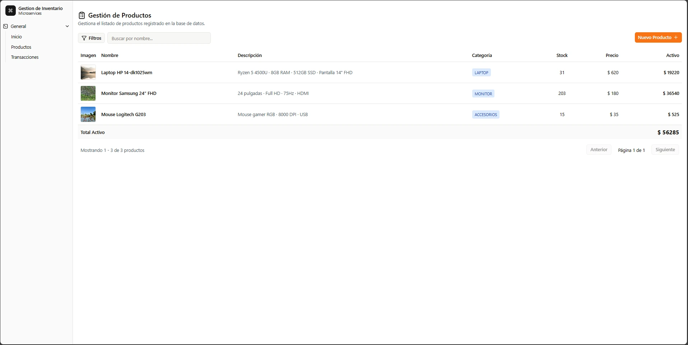
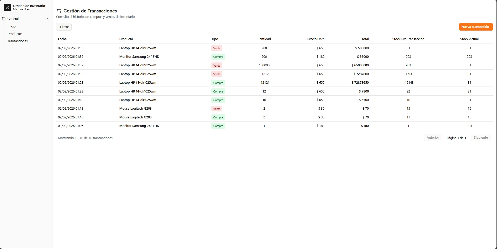
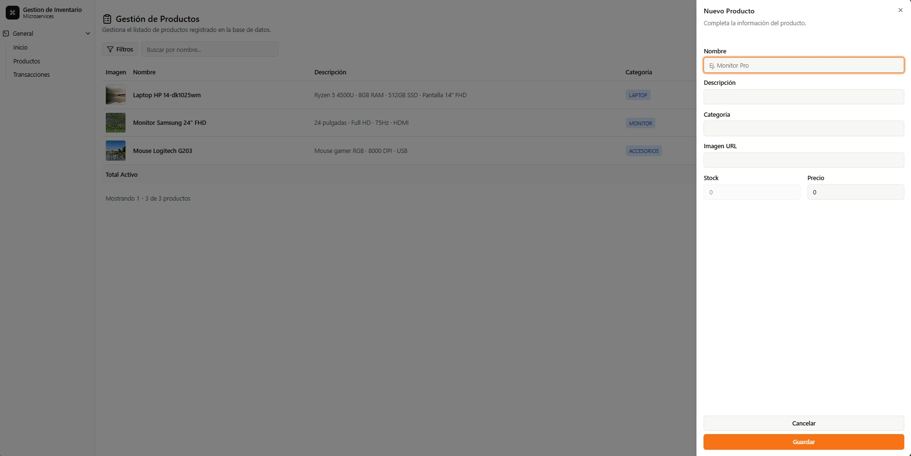
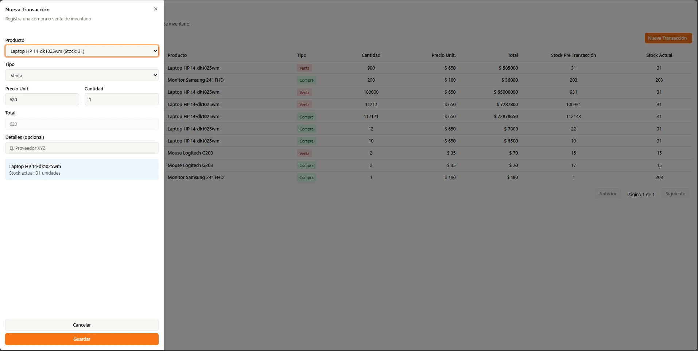
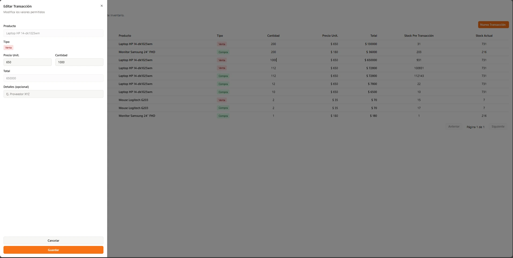
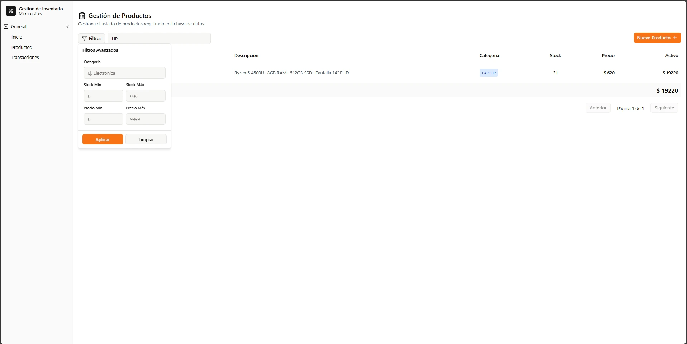
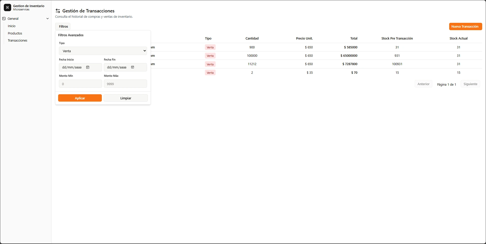
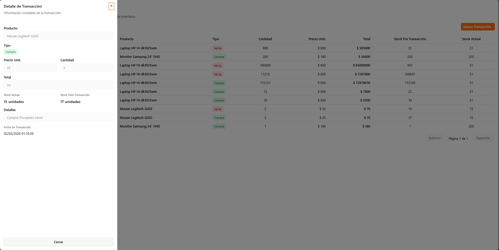

# Sistema de Gestión de Inventario

Sistema web para la gestión de productos y transacciones de inventario, desarrollado con arquitectura de microservicios.

## 🏗️ Arquitectura

- **Frontend:** Angular 18+ con Spartan UI y Tailwind CSS
- **Backend:** .NET 10 con arquitectura de microservicios
- **Base de Datos:** SQL Server
- **Comunicación:** APIs RESTful

---

## 📋 Requisitos

### Software Necesario

#### Backend
- [.NET 10 SDK](https://dotnet.microsoft.com/download/dotnet/10.0) o superior
- [SQL Server 2019+](https://www.microsoft.com/sql-server/sql-server-downloads) o SQL Server Express
- [Visual Studio 2026](https://visualstudio.microsoft.com/) o [Visual Studio Code](https://code.visualstudio.com/) con extensión C#

#### Frontend
- [Node.js 18+](https://nodejs.org/) 
- [Angular CLI 17+](https://angular.io/cli)

---

## 🗄️ Configuración de Base de Datos

### 1. Configurar Base de Datos

Ejecutar el archivo `script.sql` ubicado en la raíz del proyecto en SQL Server Management Studio


> El script creará automáticamente las tablas, índices y triggers necesarios en la base de datos que se ejecute.

---


### 2. Configurar Connection Strings

**ProductService/API/appsettings.json:**
```json
{
  "ConnectionStrings": {
    "DefaultConnection": "Server=localhost;Database=InventoryDB;Trusted_Connection=True;TrustServerCertificate=True;"
  },
  "ServiceUrls": {
    "TransactionService": "https://localhost:7192"
  }
}
```

**TransactionService/API/appsettings.json:**
```json
{
  "ConnectionStrings": {
    "DefaultConnection": "Server=localhost;Database=InventoryDB;Trusted_Connection=True;TrustServerCertificate=True;"
  },
  "ServiceUrls": {
    "ProductService": "https://localhost:7279"
  }
}
```

## 🚀 Ejecución del Backend


**Terminal 1:**
```bash
cd ProductService/API
dotnet restore
dotnet run
```

**Terminal 2:**
```bash
cd TransactionService/API
dotnet restore
dotnet run
```


---

## 💻 Ejecución del Frontend

### 1. Instalar Dependencias
```bash
cd frontend
npm install
```

### 2. Verificar Configuración

`src/environments/environment.ts`:
```typescript
export const environment = {
  apiUrls: {
    products: 'https://localhost:7279/api',
    transactions: 'https://localhost:7192/api'
  }
};
```

### 3. Ejecutar
```bash
ng serve
```

**Acceder:** `http://localhost:4200`

---


## 📸 Evidencias

### 1. Listado Dinámico de Productos con Paginación


Tabla de productos con paginación, mostrando nombre, categoría, stock, precio y acciones.

---

### 2. Listado Dinámico de Transacciones con Paginación


Tabla de transacciones con información detallada de cada movimiento de inventario.

---

### 3. Creación de Productos


Formulario modal para registrar nuevos productos con validaciones.

---

### 4. Edición de Productos


Formulario precargado para modificar información de productos existentes.

---

### 5. Creación de Transacciones


Formulario para registrar compras o ventas con validación de stock.

---

### 6. Edición de Transacciones


Formulario de edición de transacciones con ajuste automático de inventario.

---

### 7. Filtros Dinámicos - Productos


Panel de filtros avanzados por nombre, categoría, precio y stock.

---

### 8. Filtros Dinámicos - Transacciones


Filtros por tipo, rango de fechas y montos.

---

### 9. Consulta de Información - Detalle


Vista de solo lectura con información completa de la transacción.

---